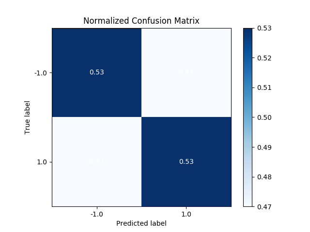
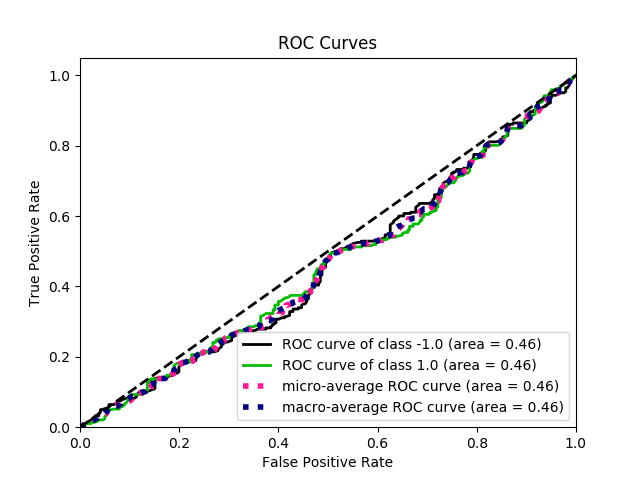
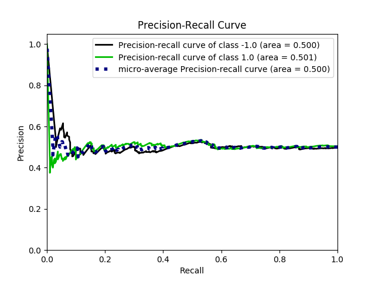
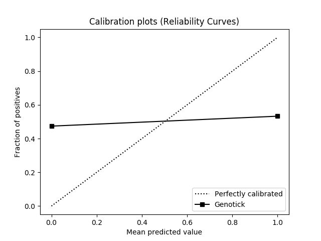

# evaluate_genotick
Generate machine learning metrics from Genotick outputs. Tested on Python 3.6 and [alphatica/genotick@`0f0cc95`](https://github.com/alphatica/genotick/commit/0f0cc956508a43d8743e89d43ac1fcfb9dc8493b)

[Genotick](https://genotick.com/) ([source](https://gitlab.com/lukasz.wojtow/genotick)) is a trading algorithm that outputs trading signals per bar of stock data: 0 for "Hold", 1 for "Buy", -1 for "Sell". The output may be evaluated as a machine learning classification problem.

The author [publicizes Genotick as a profitable system](https://genotick.com/results/), and even addresses [whether the system is better than random](https://genotick.com/static/download/IsGenotickRandom.pdf). However, when comparing the trading signals to the actual direction of the next price period, the classification metrics suggest that the system is not better than random (between 2015-2017.)

Anecdotally, Genotick appeared to make most of its gains between 2009-2012, consistent with the market's recovery from the 2008 housing crash. Since then, as the market rocks up and down, the trading signals appear to be similarly rocky. The author's cited gains may include the 2009-2012 period.

I wrote an article about [analyzing Genotick's results in a Forex backtest](https://medium.com/@mazmazz/predicting-the-markets-with-genotick-and-evaluating-the-results-fe9330a01f80). The below results concern stock market trades.

## Results

The below charts show classification metrics for [datasets/stock](datasets/stock), training between 2000-2015 and evaluating between 2015-2017. I outputted the following metrics:

* Accuracy and error scores
* [Precision, recall, F1-score, and support](https://chrisalbon.com/machine-learning/precision_recall_and_F1_scores.html)
* [Confusion matrix](http://www.dataschool.io/simple-guide-to-confusion-matrix-terminology/) (true vs false predictions)
* [ROC curve](https://stats.stackexchange.com/questions/132777/what-does-auc-stand-for-and-what-is-it) [[2](http://www.dataschool.io/roc-curves-and-auc-explained/)] (plot true vs false predictions)
* [Precision-recall curve](https://classeval.wordpress.com/introduction/introduction-to-the-precision-recall-plot/) [[2](https://stats.stackexchange.com/questions/7207/roc-vs-precision-and-recall-curves)]
* [Calibration curve](http://scikit-learn.org/stable/modules/calibration.html) (plot reliability of prediction confidence)

The results suggest a slight negative correlation between the trading signal and actual price direction, but it's pretty close to random.

I use a calibration plot to evaluate whether the system has a reliable confidence level for the trading signal, which is aggregated from a pool of "up" vs. "down" votes per signal. The plot suggests that this vote ratio has no utility as a confidence level.

   

```
             precision    recall  f1-score   support

       -1.0       0.48      0.49      0.49       280
        1.0       0.50      0.49      0.50       291

avg / total       0.49      0.49      0.49       571

Accuracy score: 0.49
Error score: 0.51
```

## Install

Depends (run `pip install` or use Anaconda3 distro):
* `pandas`
* `scikit-learn`
* `scikitplot`
* `matplotlib`

## Usage

Drop files in a directory and run main.py:

```
usage: main.py [-h] [--datagen DATAGEN] [--predictgen PREDICTGEN]
               [--dataout DATAOUT] [--predictout PREDICTOUT] [--datain DATAIN]
               [--predictin PREDICTIN] [--start START] [--end END]
               [--skipreverse] [--mode MODE [MODE ...]] [--donotdisplay]
               [--outputfiles [OUTPUTFILES]] [--pricecol PRICECOL]
               [--newpricerow NEWPRICEROW] [--oldpricerow OLDPRICEROW]
               [--predictioncol PREDICTIONCOL] [--weightupcol WEIGHTUPCOL]
               [--weightdowncol WEIGHTDOWNCOL]

Generate machine learning metrics from Genotick predictions.
You need a predictions_x.csv and the original data/ directory.

--datagen and --predictgen, or --datain and --predictin, must
be specified. --dataout and --predictout are optional.

*gen commands generate readings from Genotick outputs and
*in commands read already-generated readings saved from *out.

Suggested use, first time (to generate market readings):

  main.py --datagen "./data" --predictgen "predictions_x.csv"
    --dataout "./truth" --predictout "./predict"
    --start 20170101 --skipreverse --outputfiles

Suggested use, with already-generated market readings:

  main.py --datain "./truth" --predictin "./predict"
    --start 20170101 --skipreverse --outputfiles

optional arguments:
  -h, --help            show this help message and exit
  --datagen DATAGEN, -dg DATAGEN
                        Original data directory, to generate actual market
                        readings.
  --predictgen PREDICTGEN, -cg PREDICTGEN
                        Original predictions file, to generate predicted
                        readings.
  --dataout DATAOUT, -do DATAOUT
                        Output directory to save actual readings.
  --predictout PREDICTOUT, -co PREDICTOUT
                        Output directory to save predicted readings.
  --datain DATAIN, -di DATAIN
                        Directory to use already-generated actual readings.
  --predictin PREDICTIN, -ci PREDICTIN
                        Directory to use already-generated predicted readings.
  --start START, -s START
                        Starting TimePoint, inclusive. default: earliest
  --end END, -e END     Ending TimePoint, inclusive. default: latest
  --skipreverse, -k     Skip reverse data.
  --mode MODE [MODE ...], -m MODE [MODE ...]
                        List of metrics to process, space-separated. choices:
                        accuracy, confusion, roc, precision-recall,
                        calibration. default: all
  --donotdisplay, -b    Do not display evaluation metrics upon completion
  --outputfiles [OUTPUTFILES], -o [OUTPUTFILES]
                        Output evaluation metrics as image files. Optionally,
                        specify a filename prefix (default: "output")
  --pricecol PRICECOL, -p PRICECOL
                        In data files, price column index to determine market
                        direction. Index does not include TimePoint column
                        (i.e., open = 0). default: 0 (open)
  --newpricerow NEWPRICEROW, -n NEWPRICEROW
                        In data files, new price row to determine market
                        direction, relative to TimePoint. default: 2 (next
                        TimePoint in future)
  --oldpricerow OLDPRICEROW, -l OLDPRICEROW
                        In data files, old price row to determine market
                        direction, relative to TimePoint. default: 1 (next
                        future TimePoint)
  --predictioncol PREDICTIONCOL, -r PREDICTIONCOL
                        In prediction file, prediction column index. Index
                        does not include TimePoint column. default: 1
  --weightupcol WEIGHTUPCOL, -u WEIGHTUPCOL
                        In prediction file, vote weight up column index. Index
                        does not include TimePoint column. default: 4
  --weightdowncol WEIGHTDOWNCOL, -w WEIGHTDOWNCOL
                        In prediction file, vote weight up column index. Index
                        does not include TimePoint column. default: 5

Column and row defaults (--pricecol, --newpricerow, etc.) should already work
for Genotick. Use these settings only if you have differently formatted CSV files.
```
