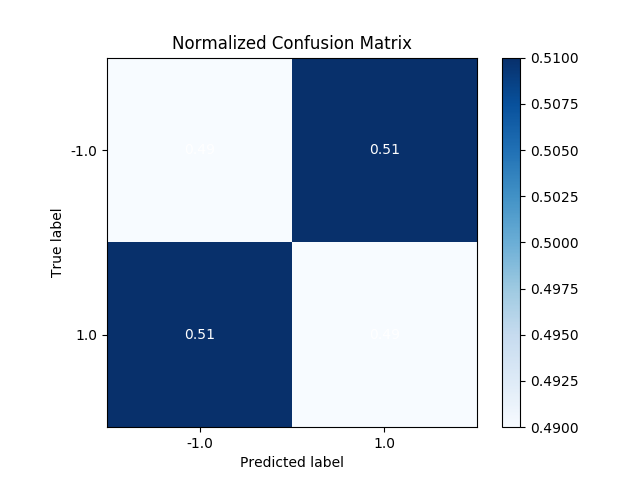
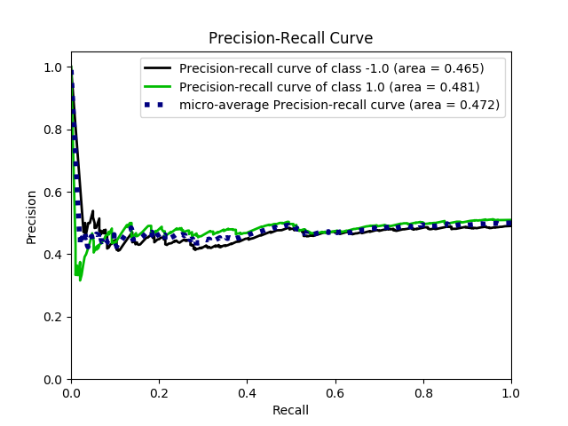
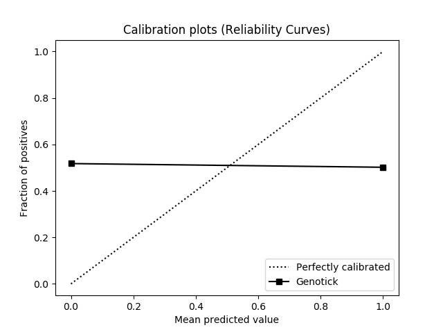

# evaluate_genotick
Generate machine learning metrics from Genotick outputs. Tested on Python 3.6. 

Requires CSV output from latest Genotick source on Github.

# Output

Outputs the following metrics:

* Accuracy and error scores
* Classification metrics: Precision, recall, F1-score, and support
* Confusion matrix (true vs false predictions)
* ROC curve (plot true vs false predictions)
* Precision-recall curve
* Calibration curve (plot reliability of prediction confidence)

   

# Install

Depends (run `pip install` or use Anaconda3 distro):
* `pandas`
* `scikit-learn`
* `scikitplot`
* `matplotlib`

# Usage

Drop files in a directory and run main.py:

```
usage: main.py [-h] [--datagen DATAGEN] [--predictgen PREDICTGEN]
               [--dataout DATAOUT] [--predictout PREDICTOUT] [--datain DATAIN]
               [--predictin PREDICTIN] [--start START] [--end END]
               [--skipreverse] [--mode MODE [MODE ...]] [--donotdisplay]
               [--outputfiles [OUTPUTFILES]] [--pricecol PRICECOL]
               [--newpricerow NEWPRICEROW] [--oldpricerow OLDPRICEROW]
               [--predictioncol PREDICTIONCOL] [--weightupcol WEIGHTUPCOL]
               [--weightdowncol WEIGHTDOWNCOL]

Generate machine learning metrics from Genotick predictions.
You need a predictions_x.csv and the original data/ directory.

--datagen and --predictgen, or --datain and --predictin, must
be specified. --dataout and --predictout are optional.

*gen commands generate readings from Genotick outputs and
*in commands read already-generated readings saved from *out.

Suggested use, first time (to generate market readings):

  main.py --datagen "./data" --predictgen "predictions_x.csv"
    --dataout "./truth" --predictout "./predict"
    --start 20170101 --skipreverse --outputfiles

Suggested use, with already-generated market readings:

  main.py --datain "./truth" --predictin "./predict"
    --start 20170101 --skipreverse --outputfiles

optional arguments:
  -h, --help            show this help message and exit
  --datagen DATAGEN, -dg DATAGEN
                        Original data directory, to generate actual market
                        readings.
  --predictgen PREDICTGEN, -cg PREDICTGEN
                        Original predictions file, to generate predicted
                        readings.
  --dataout DATAOUT, -do DATAOUT
                        Output directory to save actual readings.
  --predictout PREDICTOUT, -co PREDICTOUT
                        Output directory to save predicted readings.
  --datain DATAIN, -di DATAIN
                        Directory to use already-generated actual readings.
  --predictin PREDICTIN, -ci PREDICTIN
                        Directory to use already-generated predicted readings.
  --start START, -s START
                        Starting TimePoint, inclusive. default: earliest
  --end END, -e END     Ending TimePoint, inclusive. default: latest
  --skipreverse, -k     Skip reverse data.
  --mode MODE [MODE ...], -m MODE [MODE ...]
                        List of metrics to process, space-separated. choices:
                        accuracy, confusion, roc, precision-recall,
                        calibration. default: all
  --donotdisplay, -b    Do not display evaluation metrics upon completion
  --outputfiles [OUTPUTFILES], -o [OUTPUTFILES]
                        Output evaluation metrics as image files. Optionally,
                        specify a filename prefix (default: "output_")
  --pricecol PRICECOL, -p PRICECOL
                        In data files, price column index to determine market
                        direction. Index does not include TimePoint column
                        (i.e., open = 0). default: 3 (close)
  --newpricerow NEWPRICEROW, -n NEWPRICEROW
                        In data files, new price row to determine market
                        direction, relative to TimePoint. default: 1 (next
                        future TimePoint)
  --oldpricerow OLDPRICEROW, -l OLDPRICEROW
                        In data files, old price row to determine market
                        direction, relative to TimePoint. default: 0 (current
                        TimePoint)
  --predictioncol PREDICTIONCOL, -r PREDICTIONCOL
                        In prediction file, prediction column index. Index
                        does not include TimePoint column. default: 1
  --weightupcol WEIGHTUPCOL, -u WEIGHTUPCOL
                        In prediction file, vote weight up column index. Index
                        does not include TimePoint column. default: 4
  --weightdowncol WEIGHTDOWNCOL, -w WEIGHTDOWNCOL
                        In prediction file, vote weight up column index. Index
                        does not include TimePoint column. default: 5

Column and row defaults (--pricecol, --newpricerow, etc.) should already work
for Genotick. Use these settings only if you have differently formatted CSV files.
```
